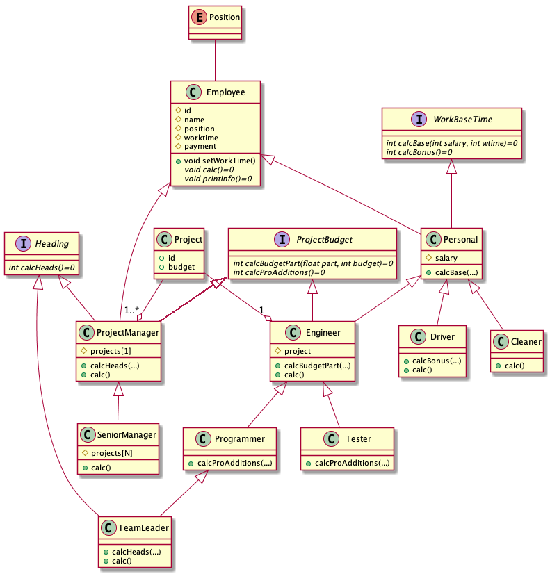

## Лабораторный практикум StaffDemo
## Дедлайн: 13 мая 00:00:00


Разработать иерархию классов в соответствии со следующей диаграммой:




Перечень классов:

- **Employee** - работник. Основной (абстрактный) родительский класс для всех разновидностей работников.
- **Pesonal** - работник по найму с оплатой за фактически отработанное время. Имеет ставку за час.
- **Engineer** - инженер. Имеет ставку и оплату за час + бонусы от выполняемого проекта.
- **Cleaner** - уборщица. Получает зарплату на основе отработанного времени.
- **Driver** - водитель. Получает зарплату на основе отработанного времени + надбавку за ночные часы.
- **Programmer** - инженер-программист. Получает зарплату за отработанное время, часть бюджета проекта и дополнительную премию за досрочно написанный код.
- **Tester** - инженер-тестировщик. Получает зарплату за отработанное время, за участие в проекте и за количество найденных ошибок.
- **TeamLeader** - ведущий программист. Получает зарплату за отработанное время, часть бюджета проекта и за руководство программистами.
- **ProjectManager** - проектный менеджер. Получает зарплату из бюджета проекта и за руководство участниками проекта.
- **SeniorManager** - руководитель направления. Получает из бюджетов всех проектов и за руководство всеми участниками.

Дополнительно предполагается создания класса/структуры **Project** для хранения информации о проекте. В этой структуре нужно хранить **название** и **бюджет**.

### Перечень интерфейсов:

- **WorkBaseTime** - расчет оплаты исходя из отработанного времени.

  - **calcBase** - метод расчета зарплаты исходя из оклада (за час) и отработанных часов
  - **calcBonus** - дополнительные выплаты

- **ProjectBudget** - расчет оплаты исходя из участия в проекте (бюджет проекта делится пропорционально персональному вкладу).
  
  - **calcBudgetPart** - расчет выплат из бюджета проекта
  - **calcProAdditions** - расчет *бонусных* выплат

- **Heading** - расчет оплаты исходя из руководства (количество подчиненных).


### Класс Employee

Этот, наиболее важный класс, должен содержать поля:

- **id** - идентификационный номер.
- **name** - ФИО.
- **worktime** - отработанное время.
- **payment** - заработная плата.

Полю **worktime** присваивается фактически отработанное время (независимо от должности). После вызова виртуального метода **calc** происходит расчет зарплаты с учетом всех бонусов и полю **payment** присваивается вся сумма.

### Файл данных

Подготовить текстовый файл со списком сотрудников. Информация о каждом сотруднике должна включать:

- **id** - идентификационный номер.
- **name** - ФИО сотрудника.
- **position** - должность.
- **salary** - базовая ставка руб./час (если нужна).
- **project** - название проекта (если нужен).

### Приложение

Написать демонстрационное приложение, которое создает штат сотрудников на основе данных из текстового файла и рассчитывает им зарплату, исходя из отработанного времени и участия в проектах. Информация о сотрудниках, об отработанном времени и заработной плате выводится на экран в виде таблицы.

```cpp

// создание штата сотрудников на основе файла
vector<Employee*> staff = StaffFactory::makeStaff(...);

// присвоение отработанного времени
for(Employee emp: staff) {
   emp -> setWorkTime(...);
}

// расчет зарплаты
for(Employee emp: staff) {
   emp -> calc(...);
}

// вывод данных о зарплате
for(Employee emp: staff) {
   emp -> printInfo(...);
}
```

### Состав проекта

- Interfaces.h 
- Employee.h 
- Manager.h 
- Personal.h 
- Engineer.h 
- Factory.h
- Employee.cpp 
- Personal.cpp 
- Engineer.cpp 
- Manager.cpp 
- Factory.cpp
- main.cpp
